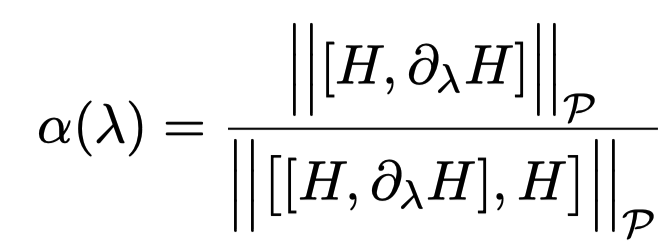

$\beta = \frac{-2\dot{\lambda}\overline{\alpha}}{\lambda}$  
$\lambda = \frac{\gamma}{\gamma+\beta}$  
$\lambda^{'} = \frac{\gamma}{\gamma+\beta^{'}}$  
$\dot{\lambda} = \frac{\lambda-\lambda^{'}}{\tau}$  
$\tau = \gamma + \beta$  
化简后  
$\beta = $

## alpha

